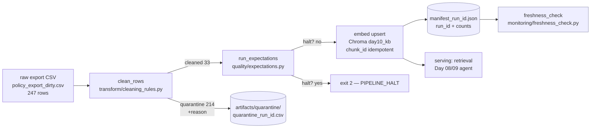

# Kiến trúc pipeline — Lab Day 10 (reference solution)

**Nhóm:** Reference (GV)
**Cập nhật:** 2026-06-10

---

## 1. Sơ đồ luồng

- **Điểm đo freshness:** tại `publish` — `latest_exported_at` ghi trong manifest (sau embed visible).
- **run_id:** sinh ở đầu `cmd_run` (UTC timestamp hoặc `--run-id`), gắn vào log, manifest, metadata mỗi vector.
- **quarantine:** mọi dòng loại bỏ → CSV kèm `reason` (không silent drop).

---

## 2. Ranh giới trách nhiệm

| Thành phần | Input | Output | Owner nhóm |
|------------|-------|--------|--------------|
| Ingest | `data/raw/*.csv` | `rows` (dict) + `raw_records` | Ingestion Owner |
| Transform | `rows` | `cleaned`, `quarantine` (+reason) | Cleaning/Quality Owner |
| Quality | `cleaned` | `ExpectationResult[]` + `halt` | Cleaning/Quality Owner |
| Embed | `cleaned_csv` | Chroma collection `day10_kb` (upsert + prune) | Embed Owner |
| Monitor | `manifest.json` | freshness PASS/WARN/FAIL | Monitoring/Docs Owner |

---

## 3. Idempotency & rerun

- **Upsert theo `chunk_id`** (hash ổn định của `doc_id|chunk_text|seq`) ⇒ rerun cùng dữ liệu **không** tạo vector trùng.
- **Prune:** trước upsert, xoá mọi id Chroma **không còn** trong cleaned run hiện tại
  (`embed_prune_removed=N` trong log) ⇒ index = snapshot publish, tránh "mồi cũ" stale làm fail grading.
- Rerun 2 lần: `collection.count()` giữ nguyên = `cleaned_records` (xem mục 4 quality report).

---

## 4. Liên hệ Day 09

- Pipeline làm mới corpus CS + IT Helpdesk **cùng `data/docs/`** mà agent Day 09 dùng để retrieval.
- Day 10 tách collection riêng `day10_kb` (env `CHROMA_COLLECTION`) để không đụng index Day 09 khi thử nghiệm;
  khi tích hợp thật, agent Day 09 trỏ retriever vào collection do pipeline này publish.
- Thông điệp xuyên suốt: *Agent Day 09 chỉ đúng nếu corpus Day 10 sạch + đúng version + tươi.*

---

## 5. Rủi ro đã biết

- Embedding model tải lần đầu cần mạng (`sentence-transformers` → HF, hoặc fallback ONNX qua `onnxruntime`).
- Freshness dựa trên `exported_at` của data mẫu (cũ) → FAIL hợp lý trên snapshot; cần phân biệt SLA cho "snapshot" vs "pipeline run".
- Allowlist là biên kiểm soát: thêm doc mới phải sửa **cả** `cleaning_rules.py` lẫn `contracts/data_contract.yaml` (nếu lệch → `doc_coverage_min` / `access_control_present` bắt được).
